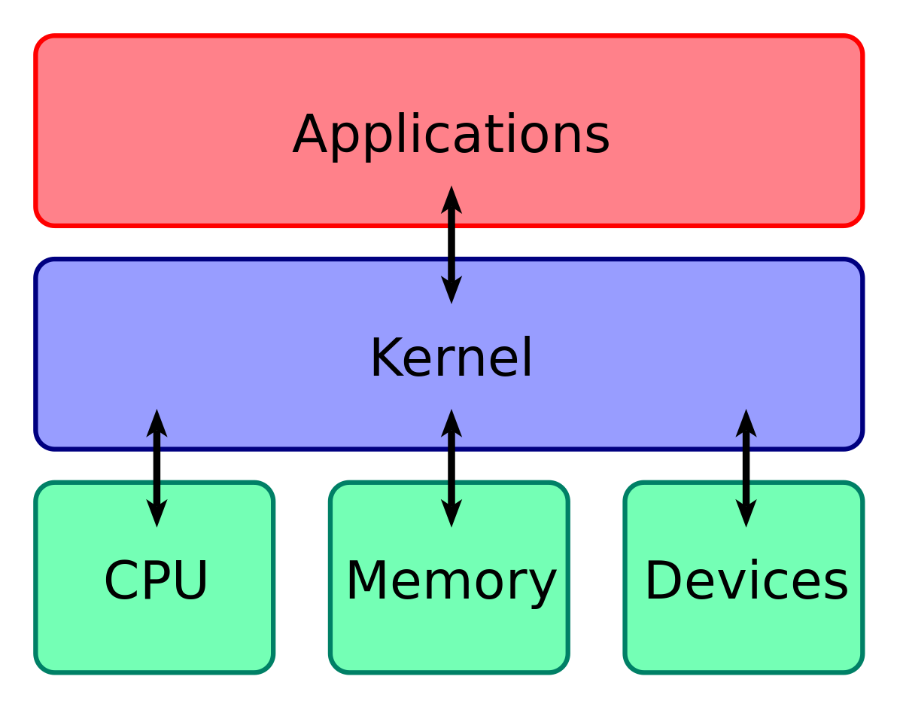
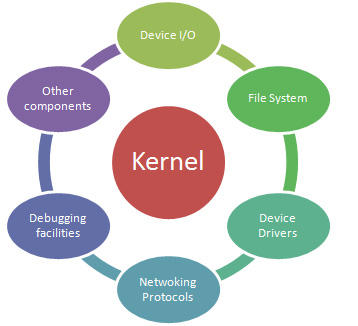
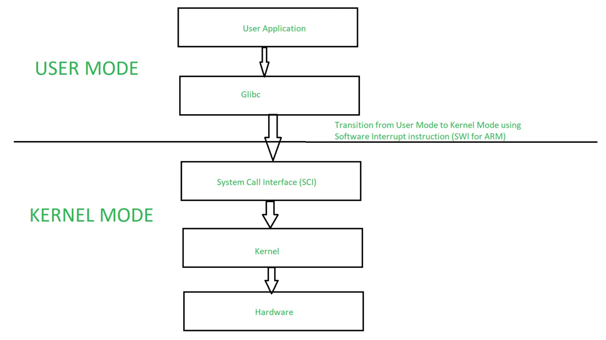
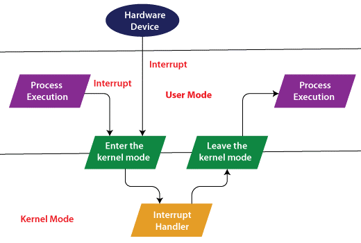
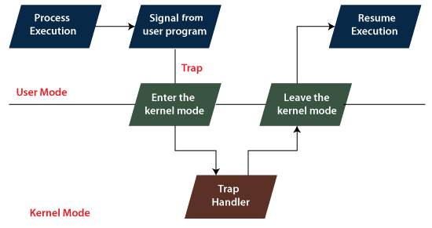

# Tipos de Kernel y sus diferencias
## Kernel
El Kernel es el núcleo central de un sistema operativo que proporciona servicios esenciales para que otros programas puedan ejecutarse. Se encarga de gestionar recursos del hardware y brindar una interfaz para la interacción entre el software y el hardware.

## Funciones principales del Kernel
- Gestión de memoria 
- La planificación de procesos
- La administración de archivos
- La comunicación entre hardware y software
- Responsable de garantizar la estabilidad y el rendimiento del sistema operativo.
  

## Tipos de Kernel
- **Monolítico:** Todas las funciones del sistema operativo se ejecutan en espacio de núcleo, compartiendo un único bloque de código. Este enfoque proporciona eficiencia pero puede afectar la flexibilidad.
- **Microkernel:** Implementa solo las funciones esenciales en el espacio de núcleo, moviendo servicios no esenciales al espacio de usuario. Esto mejora la flexibilidad, pero puede tener un impacto en el rendimiento.
- **Híbrido:** Combina características de los monolíticos y los microkernels para lograr un equilibrio entre eficiencia y flexibilidad.
- **Exokernel:** Expone directamente los recursos de hardware a las aplicaciones, permitiendo un control más preciso y eficiente sobre los recursos.
- **Nanokernel:** Similar al microkernel pero más minimalista, proporciona solo las funciones esenciales para la comunicación entre hardware y software.

## Tabla comparativa de los diferentes tipos de kernel

| Tipo de Kernel | Ventajas | Desventajas |
|----------------|----------|-------------|
| **Monolítico**      | - Rendimiento eficiente. | - Mayor acoplamiento. |
|                 | - Acceso directo a recursos de hardware. | - Menos modularidad. |
|                 | - Implementación simple. | - Menor flexibilidad. |
|                 | | - Dificultad en la depuración y mantenimiento. |
| **Microkernel**     | - Mayor modularidad. | - Menor eficiencia en algunos casos. |
|                 | - Mayor seguridad. | - Mayor complejidad en la implementación. |
|                 | - Facilita la extensibilidad. | - Rendimiento potencialmente inferior. |
|                 | - Mejora en la confiabilidad. | |
| **Híbrido**         | - Equilibrio entre eficiencia y flexibilidad. | - Mayor complejidad en comparación con monolítico. |
|                 | - Rendimiento aceptable. | - Posible pérdida de velocidad por servicios en espacio de usuario. |
|                 | - Mayor modularidad que el monolítico. | |
| **Exokernel**       | - Control preciso sobre recursos. | - Requiere un mayor nivel de conocimiento del hardware. |
|                 | - Eficiencia en la asignación de recursos. | - Menos abstracción que otros modelos. |
|                 | - Potencial para un rendimiento óptimo. | - Mayor complejidad en la programación de aplicaciones. |
|                 | | - Requiere aplicaciones más específicas. |
| **Nanokernel**      | - Mínimo y eficiente. | - Puede carecer de ciertas funciones esenciales. |
|                 | - Ideal para sistemas embebidos y específicos. | - Menor versatilidad. |
|                 | - Requiere menos recursos. | - Menos soporte para sistemas complejos. |
|                 | | - Limitado en términos de aplicaciones y servicios. |
## Kernel de diferentes Sistemas Operativos
- **Linux (Monolítico):** Esto significa que la mayoría de las funciones del sistema operativo se ejecutan en el espacio del núcleo. Esto proporciona una ejecución eficiente y rápida, pero con un mayor acoplamiento entre las funciones.
- **QNX (Microkernel):** El kernel implementa solo las funciones esenciales, y servicios no críticos se ejecutan en el espacio de usuario. Esto garantiza modularidad y seguridad, permitiendo una mayor flexibilidad y confiabilidad.
- **Windows (Híbrido):** Combinando elementos de monolítico y microkernel. Funciones críticas se ejecutan en el espacio de núcleo para eficiencia, mientras que servicios no esenciales se desplazan al espacio de usuario, mejorando la estabilidad. Este enfoque busca equilibrar eficiencia y flexibilidad.
  

 
 
 
 
 

# User vs Kernel Mode
## Modos de operación del procesador
Son configuraciones específicas que determinan el nivel de acceso y los privilegios que un programa o componente del sistema operativo tiene sobre los recursos del hardware. Estos modos, como el **Modo Usuario** y el **Modo Núcleo**, definen las restricciones y los niveles de control para garantizar la seguridad, estabilidad y eficiencia en la ejecución de programas en un sistema informático. El cambio entre estos modos es esencial para realizar operaciones críticas y asegurar el funcionamiento adecuado del sistema operativo.

## User Mode
El **User Mode** (Modo Usuario) es una configuración del procesador que restringe las acciones y accesos a recursos del sistema para las aplicaciones y programas normales. En este modo, las operaciones se realizan con privilegios limitados y a través de interfaces proporcionadas por el sistema operativo.

## Kernel Mode
El **Kernel Mode** (Modo Núcleo) es un nivel privilegiado del procesador que permite al sistema operativo acceder y controlar recursos críticos del hardware. En este modo, el sistema operativo puede realizar funciones esenciales sin restricciones, garantizando la estabilidad y el correcto funcionamiento del sistema.

## Cambios de Modo
Se refieren a la transición entre el Modo Usuario y el Modo Núcleo. Estos cambios son necesarios para realizar operaciones críticas que requieren privilegios elevados, como acceder al hardware o ejecutar funciones esenciales del sistema operativo. Los eventos que desencadenan estos cambios incluyen interrupciones, llamadas al sistema y excepciones.

## Tabla comparativa

| Aspecto                | Modo Usuario                                  | Modo Núcleo                                        |
|------------------------|-----------------------------------------------|----------------------------------------------------|
| **Privilegios**        | Limitados, acceso restringido a recursos.     | Amplios, control total sobre el sistema.            |
| **Operaciones**        | Operaciones estándar de aplicaciones.         | Funciones críticas del sistema operativo.          |
| **Acceso a Hardware**  | Restringido, a través de servicios del kernel. | Acceso directo y completo al hardware.               |
| **Seguridad**          | Mayor restricción para proteger la estabilidad. | Necesario para garantizar la seguridad del sistema. |

 
 
 
 
 

# Interruptions vs Traps

## Interruptions (Interrupciones)
Son eventos asíncronos que detienen temporalmente la ejecución normal de un programa para manejar situaciones específicas. Pueden ser generadas por hardware o software y son esenciales para gestionar eventos externos como señales de dispositivos y solicitudes de servicios del sistema operativo.

## Traps (Trampas)
Las trampas (o excepciones) son eventos generados internamente por un programa en ejecución para manejar condiciones anómalas o errores detectados durante su ejecución, como división por cero o violaciones de acceso a la memoria.

## Importancia 
### Importancia de Interruptions
Las interrupciones permiten una respuesta inmediata a eventos externos sin depender de la ejecución secuencial del programa principal. Son fundamentales para la eficiencia y la multitarea, ya que permiten que el sistema operativo atienda eventos concurrentes.

### Importancia de Traps
Las trampas son cruciales para la detección y manejo de errores, garantizando la estabilidad y la integridad del sistema. Proporcionan un mecanismo para lidiar con situaciones imprevistas y prevenir que los errores afecten gravemente el funcionamiento del sistema.

## Tabla Comparativa
| Aspecto            | Interrupciones                                 | Trampas (Excepciones)                          |
|--------------------|------------------------------------------------|-----------------------------------------------|
| **Origen**         | Externo (Hardware o Software)                  | Interno (Generadas por el programa en ejecución) |
| **Causa**          | Eventos de hardware, señales externas.         | Condiciones anómalas o errores internos.      |
| **Gestión**        | Manjeada por el sistema operativo.              | Manejadas por el propio programa o el sistema operativo. |
| **Ejemplo**        | Interrupción de temporizador, solicitud de E/S. | División por cero, acceso a memoria no válido. |

