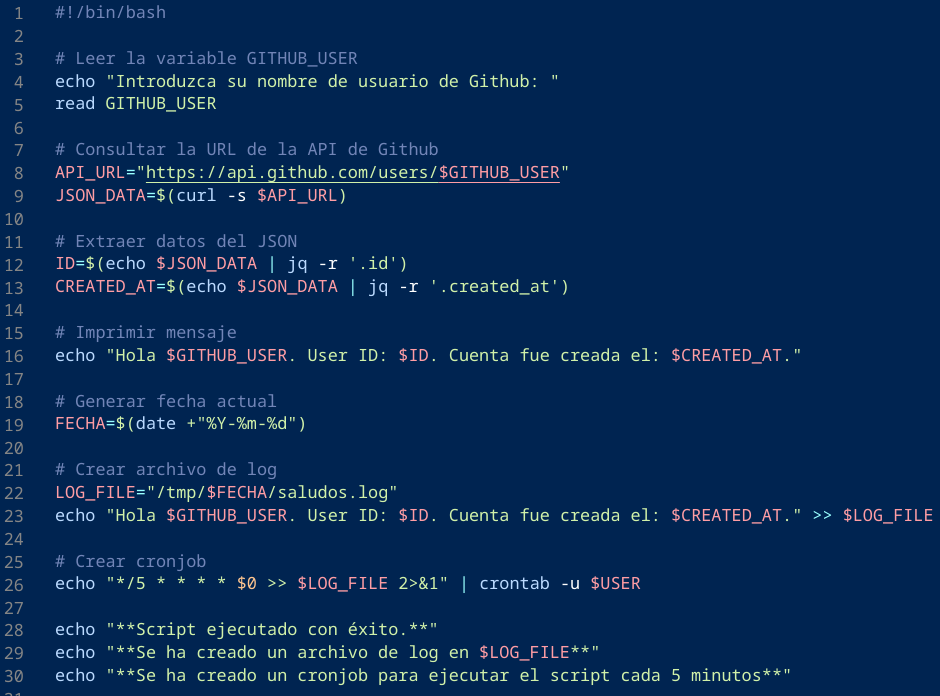

# Actividad 2 - Sistemas Operativos 1

 

## Autor

**Nombre:** Steven Facundo Mejía Xolop 
 
**Carnet:** 202104160
 
**Curso:** Sistemas Operativos 1

 
 

## Código

    #!/bin/bash
    # Indica que es un script de Bash

    # Leer la variable GITHUB_USER
    echo "Introduzca su nombre de usuario de Github: "
    read GITHUB_USER
    # Solicita al usuario que ingrese su nombre de usuario de GitHub y lo guarda en la variable GITHUB_USER

    # Consultar la URL de la API de Github
    API_URL="https://api.github.com/users/$GITHUB_USER"
    JSON_DATA=$(curl -s $API_URL)
    # Construye la URL de la API de GitHub con el nombre de usuario ingresado y consulta los datos usando curl. Guarda la respuesta en la variable JSON_DATA.

    # Extraer datos del JSON
    ID=$(echo $JSON_DATA | jq -r '.id')
    CREATED_AT=$(echo $JSON_DATA | jq -r '.created_at')
    # Utiliza jq para extraer el ID y la fecha de creación del JSON obtenido de la API.

    # Imprimir mensaje
    echo "Hola $GITHUB_USER. User ID: $ID. Cuenta fue creada el: $CREATED_AT."
    # Imprime un mensaje saludando al usuario y mostrando información obtenida de la API de GitHub.

    # Generar fecha actual
    FECHA=$(date +"%Y-%m-%d")
    # Obtiene la fecha actual en el formato especificado.

    # Crear archivo de log
    LOG_FILE="/tmp/$FECHA/saludos.log"
    echo "Hola $GITHUB_USER. User ID: $ID. Cuenta fue creada el: $CREATED_AT." >> $LOG_FILE
    # Crea un archivo de log en el directorio /tmp con la fecha actual y agrega información sobre la cuenta de GitHub.

    # Crear cronjob
    echo "*/5 * * * * $0 >> $LOG_FILE 2>&1" | crontab -u $USER
    # Configura un cronjob para ejecutar el script cada 5 minutos y redirige la salida al archivo de log.

    echo "**Script ejecutado con éxito.**"
    echo "**Se ha creado un archivo de log en $LOG_FILE**"
    echo "**Se ha creado un cronjob para ejecutar el script cada 5 minutos**"
    # Imprime mensajes indicando el éxito de la ejecución y la creación del archivo de log y cronjob.

## Captura

