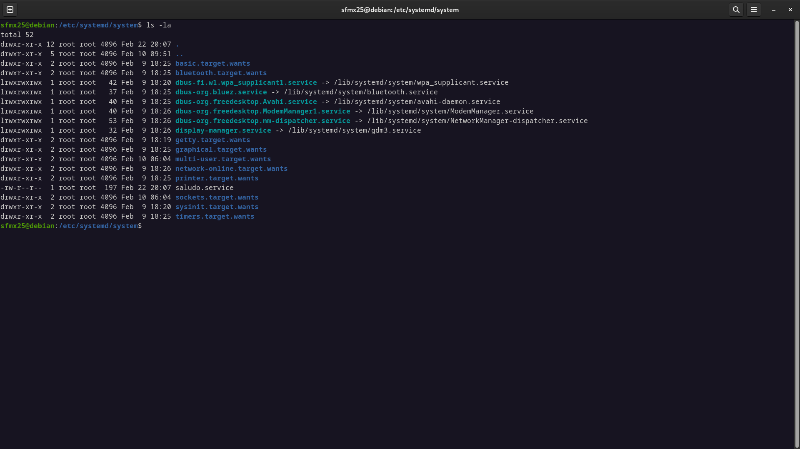

# Actividad 3 - Systemd Unit

<br>

## Servicio de Saludo
Este servicio imprime un saludo y la fecha actual infinitamente con una pausa de un segundo.

<br>

## Código del servicio

```bash

    [Unit]
    Description=Servicio del Saludo

    [Service]
    Type=simple
    ExecStart=script_saludo.sh    #Ruta en donde se encuentra el script.
    Restart=always
    RestartSec=1

    [Install]
    WantedBy=multi-user.target

```

<br>

## Código del Script

```bash

    #!/bin/bash

    while true; do
        echo "!Hola! La fecha y hora actual es: $(date)"
        sleep 1
    done


```

<br>


## Instalación

*  Primero es importante asegurarse de que el script tenga los permisos de ejecución:

<br>
<br>

```bash

        sudo chmod +x script_saludo.sh    #Ruta en donde se encuentra el script.

```

<br>

* Después de crear el archivo script se debe crear el archivo `saludo.service` en la siguiente ruta: 

<br>
<br>

```bashd

        sudo nano /etc/systemd/system/saludo.service

```

<br>

* Despues de crear el archivo en la unidad de `saludo.service` en systemd se debe habilitar el servicio para que se inicie automaticamente con el sistema.

<br>
<br>

```bashd

        sudo systemctl enable saludo.service

```

<br>

* Luego de crear el archivo y de habilitarlo es momento de iniciar el servicio con el siguiente comando. 

<br>
<br>

```bashd

        sudo systemctl start saludo.service

```

<br>

* Una vez ya iniciado el servicio podemos ver el estado del servicio con el siguiente comando.

<br>
<br>

```bashd

        sudo systemctl status saludo.service

```

<br>

* Para ver los registros `logs` del servicio, ser puede utilizar el siguiente comando:

<br>
<br>

```bashd

        journalctl -u saludo.service

```


## Capturas


<br>


<br>



<br>


## Autor

**Nombre:** Steven Facundo Mejía Xolop 

<br>

**Carnet:** 202104160

<br>

**Curso:** Sistemas Operativos 1

<br>
<br>
