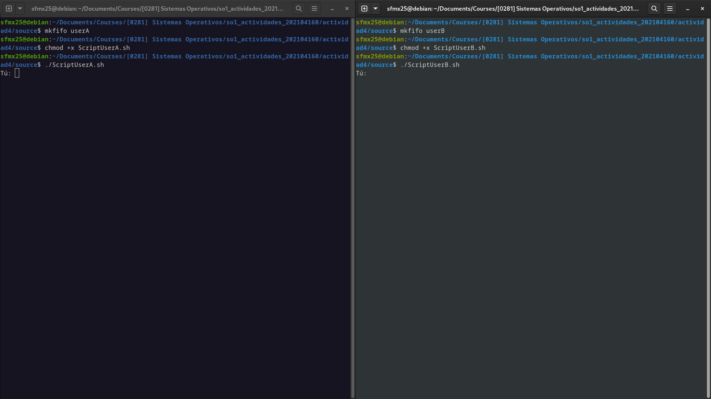

# Actividad 4 - Chat Básico utilizando Named Pipes y Bash en Linux

Este es un chat básico que permite la comunicación entre dos participantes utilizando Named Pipes en Linux y scripts de Bash.

## Descripción

El chat se compone de dos scripts de Bash, uno para cada participante (Usuario A y Usuario B), que se comunican a través de dos Named Pipes. Cada usuario tiene su propio script y su propio Named Pipe para enviar y recibir mensajes.

## Codigo Utilizado

### Codigo para el chat del usuario 1

### Codigo para el chat del usuario 2

## Proceso

1. **Crear Named Pipe para Usuario A:** 
   
   

2. **Crear Named Pipe para Usuario B:** 
   
   

3. **Conceder permisos a los scripts:**
   
   - **ScriptUserA.sh:**
     
     
   
   - **ScriptUserB.sh:**
     
     

## Ejecución

1. **Usuario A:**
   
   - Ejecutar el archivo `ScriptUserA.sh`
     
     

2. **Usuario B:**
   
   - Ejecutar el archivo `ScriptUserB.sh`
     
     

