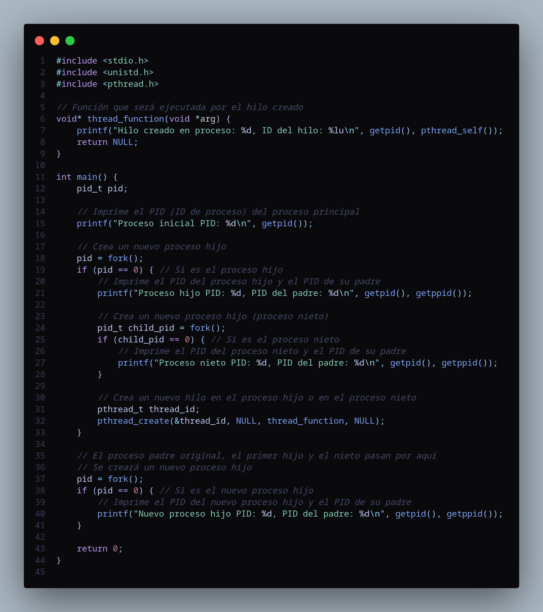

# Actividad 5: Prueba de Procesos e Hilos

Este repositorio contiene un programa en lenguaje C que crea procesos e hilos. Se debe completar el programa para que sea ejecutable y luego responder a las siguientes preguntas:

### Preguntas

Después de ejecutar el programa, se deben responder las siguientes preguntas:

* a) ¿Cuántos procesos únicos son creados?
* b) ¿Cuántos hilos únicos son creados?

## Descripción del Código

El código proporcionado crea procesos e hilos utilizando la función `fork()` y la biblioteca de hilos `pthread.h`. Aquí hay una descripción detallada del código:

- Se crean procesos utilizando la función `fork()`.
- Dentro de uno de los procesos creados, se crean hilos utilizando `pthread_create()`.
- Cada proceso e hilo imprime su ID (PID o ID del hilo) para propósitos de seguimiento.
- Después de la ejecución del programa, se deben contar los procesos únicos creados y los hilos únicos creados.

## Ejecución del Programa

1. **Compilación del Código**: El código debe compilarse utilizando un compilador de C, como GCC. Por ejemplo:

    ```
    gcc proceso_hilo_test.c -o proceso_hilo_test -pthread
    ```

2. **Ejecución del Programa**: Después de compilarlo, el programa puede ejecutarse de la siguiente manera:

    ```
    ./proceso_hilo_test
    ```


a) ¿Cuántos procesos únicos son creados?
b) ¿Cuántos hilos únicos son creados?

## Respuestas

* a) El número de procesos únicos creados es: `3`.
* b) El número de hilos únicos creados es `1`.

## Código



